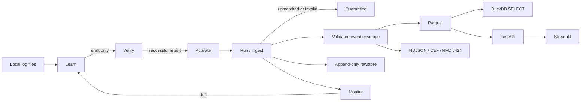
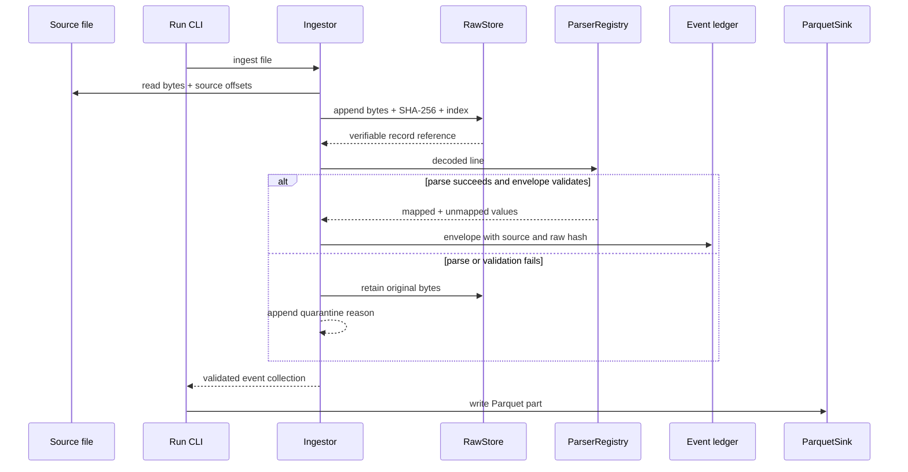
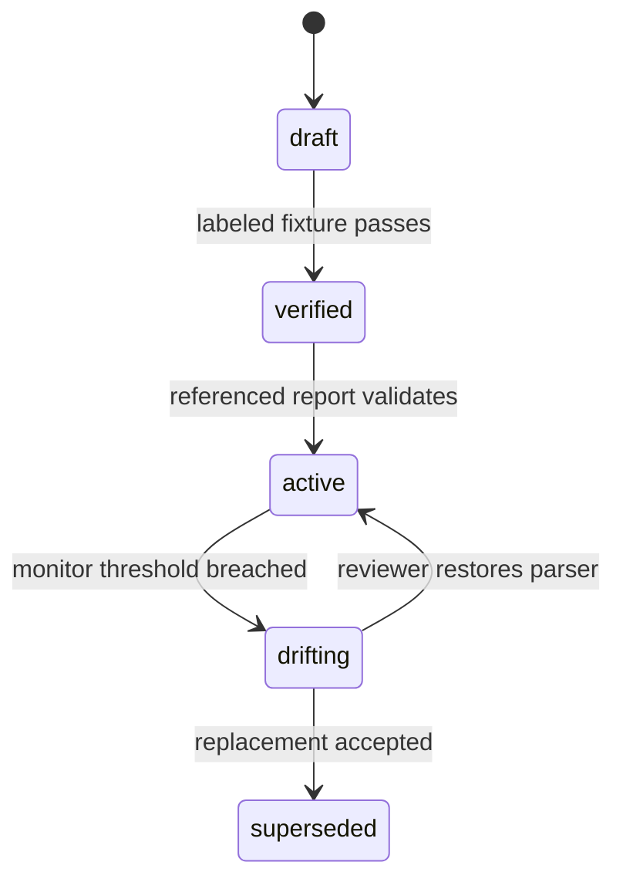

# RosettaLog architecture

## 1. Purpose and system boundary

RosettaLog converts bounded, line-oriented perimeter-device logs into validated
event envelopes. Its lifecycle is Learn -> Verify -> Run -> Monitor. The
implementation supports four YAML parser templates (ASA-style syslog, FortiGate
key/value, CEF, and JSON), plus CSV with a recognized header row. It is
OCSF-aligned to the checked-in subset, not a complete OCSF implementation.

The application processes local files and has no model service or network
dependency at runtime. The Docker Compose design puts the API and UI on an
internal network and binds their ports to loopback. The image build and Compose
network behavior have not been executed because Docker is unavailable on the
development machine; see `docs/limitations.md`.

## 2. Ingestion and traceability

`Ingestor` reads source files in binary mode. It appends raw bytes to the
compressed store before decoding or parsing. A record that is oversized,
invalid UTF-8, unmatched, or rejected by a parser remains in the rawstore and
receives a reason-coded quarantine entry. Successful parses are converted into
envelopes and checked against the frozen schema before being appended to the
event ledger. The `run` CLI passes the validated event collection to the
Parquet sink after ingestion completes.

Each rawstore entry is an independent Zstandard frame. `index.jsonl` records
sequence, frame offset and size, raw size, digest, source identity, byte offset,
and 1-based line number. Store verification checks contiguous frames and index
integrity. `event_id` is a deterministic SHA-256 digest over source identity,
byte offset, and raw digest. `trace` resolves an envelope back to its rawstore
reference; `verify-event` and `verify-store` validate hashes, schemas, and
lineage.

Optional IP truncation and username hashing modify only normalized values after
the raw bytes have been stored. Duplicate normalized events remain in the
output and link to the first event ID; the count records later occurrences
within one input file. CSV's recognized header row is retained in rawstore but
does not become an event.

The raw payload in the envelope is the UTF-8 representation of the original
record, including its line ending. It is not a replacement for the rawstore:
the rawstore retains the exact bytes. Parser values not mapped into the common
event are kept under `unmapped`; the exporter also embeds the complete
canonical envelope when producing CEF and syslog.

## 3. Parser lifecycle and verification

Parser YAML files are validated by the frozen parser schema. `ParserRegistry`
loads only `verified` and `active` definitions and compiles their expressions
with RE2. Learner output always remains `draft` and is written outside the
runtime parser directory.

`ParserVerifier` checks an explicitly labeled JSONL fixture. Positive rows name
the expected template and required fields; negative rows use a null expected
template. A candidate passes only if all positive examples are covered,
negative examples remain unmatched, required fields are present, no expression
is outside RE2 syntax, and raw values round-trip unchanged. JSON and escaped
HTML reports are written for reviewer inspection. Activation requires a
successful report reference for the same parser name and version.

Monitoring computes coverage and mean confidence over a bounded input batch.
On drift it writes a report and may create a new, schema-valid draft parser from
unmatched records. It does not activate that proposal. Verification reports
and parser files are not signed, so local write access remains part of the
trust boundary. Scheduled monitoring and persistent baselines are **STUB**.

## 4. Query, export, and operator interfaces

`ParquetSink` writes deterministic Parquet parts from validated envelopes.
DuckDB queries run in memory over registered Parquet data and accept only a
single SELECT statement with external access disabled. API event queries use a
fixed, bounded SELECT rather than accepting user SQL.

The exporters validate every input envelope. NDJSON preserves the full object.
CEF and RFC 5424 syslog provide conventional indexed fields and also carry a
Base64-encoded canonical envelope so that raw data, source position, parser
metadata, flags, and `unmapped` values are not lost during flattening.

FastAPI exposes `/health`, `/parsers`, `/ingest`, and `/events`. Uploads stream
to a local incoming directory with a 50 MiB default limit and are passed through
the same raw-first ingestion pipeline. Streamlit presents upload, parser
inventory, and recent-event views; it calls the API over the local Compose
network or a configured local API URL.

## 5. Contracts, security, and operational boundaries

The following files are frozen Gate 0 contracts and are not changed by later
gates:

- `schemas/envelope.schema.json`
- `schemas/parser.schema.json`
- `schemas/ocsf_subset.json`

Inputs are bounded by file, record, and row-count limits at relevant entry
points. RE2 avoids catastrophic backtracking for parser patterns. YAML and
event envelopes are schema-validated. Read-only SQL disallows semicolons and
external file access. CLI errors are reported instead of silently turning
invalid input into successful empty results.

The rawstore and reports may contain sensitive paths or event data. CEF and
syslog exports include a recoverable complete envelope; protect their
destinations accordingly. The API does not provide authentication and should
only be exposed behind a trusted, authenticated boundary. **STUB:** API
authentication, multiline assembly, Grok export, and ML-specific export.
Duplicate events are linked, never suppressed.

## 6. Implementation map

| Component | Implementation |
|---|---|
| Parser loading and execution | `src/rosettalog/parsing.py` |
| Learning and draft review | `src/rosettalog/learning.py` |
| Verification, reports, and state machine | `src/rosettalog/verification.py` |
| Raw-first ingestion and quarantine | `src/rosettalog/ingest.py` |
| Compressed rawstore and lineage index | `src/rosettalog/rawstore.py` |
| Parquet and restricted DuckDB | `src/rosettalog/analytics.py` |
| Drift monitoring and re-learn proposals | `src/rosettalog/monitoring.py` |
| NDJSON, CEF, and syslog export | `src/rosettalog/exports.py` |
| Local service and user interface | `src/rosettalog/api/`, `src/rosettalog/ui/` |
| Offline container workflow | `Dockerfile`, `docker-compose.yml`, `scripts/test-airgap.ps1` |

## 7. Gate status

Gate 0 through Gate 4 have code and automated tests in this repository. The
network-disabled Docker build and Compose smoke test are **UNTESTED** because
Docker is unavailable in the current environment. Measured parser throughput
and its limits are recorded in `docs/benchmarks.md`.
