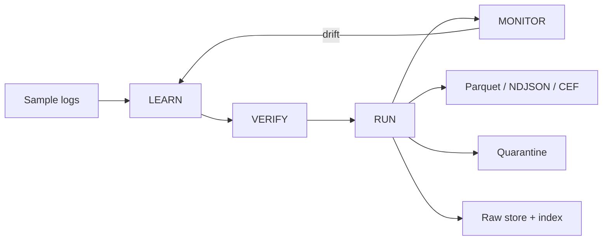

# RosettaLog architecture

## System overview

RosettaLog is a deterministic, offline log-normalization framework for perimeter devices. The system uses a four-stage lifecycle: Learn -> Verify -> Run -> Monitor.



## Gate 0 baseline

This repository freezes the baseline contracts before runtime behavior is implemented. The current version includes:

- schema validation for envelope and parser contracts
- OCSF-aligned subset definition
- CI and offline Docker build scaffolding
- documentation skeleton and decisions log

## Envelope model

The event envelope keeps raw bytes and normalized output separate so every normalized event can be traced back to the original line.

```json
{
  "event_id": "01J9...",
  "ingest_time": "2026-09-29T08:15:00Z",
  "source": {"id": "fw01", "file": "fw01.log", "byte_offset": 48213, "line_no": 812},
  "raw": "original line",
  "raw_sha256": "...",
  "parser": {"name": "asa_syslog", "version": 1, "confidence": 0.97},
  "event": {"time": "2026-09-29T08:15:00Z", "class_name": "Network Activity", "action": "deny"},
  "unmapped": {"vendor_field": "value"},
  "flags": {"duplicate_of": null, "duplicate_count": 0, "tz_assumed": false, "masked": true}
}
```

## Requirement traceability summary

| Req | Gate 0 state |
|---|---|
| a. Lossless raw | baseline contract and raw-store design documented |
| b. Source-specific attributes | `unmapped` retention is part of the schema |
| c. Common taxonomy | OCSF-aligned subset is defined in the schemas |
| d. Traceability | event ID + raw hash + source offset documented |
| e. Plug-and-play onboarding | parser contract and sample pipeline provided |
| f. Unified visibility | planned query layer is documented |
| g. SIEM/data lake export | sink contracts are in the planned architecture |
| h. AI/ML-ready | typed flat columns are included in the design |
| i. Less parser effort | benchmark plan documented |
| j. Air-gapped | offline Docker + vendor wheel path included |
| k. Container | Docker and Compose scaffold included |

## Future gate plan

- Gate 1: known-format parsers, rawstore, quarantine, Parquet sink, trace APIs
- Gate 2: learner and leave-one-out validation
- Gate 3: verifier gate, state machine, benchmarks
- Gate 4: monitor, export adapters, API, UI, air-gap tests

## Current status

The current repository is a deliberately small but valid starting point. It is intended to be used as a schema-secured foundation for the later implementation gates.
